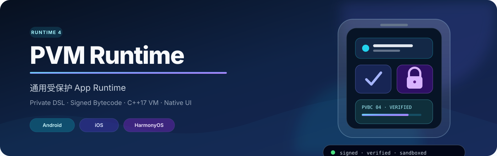
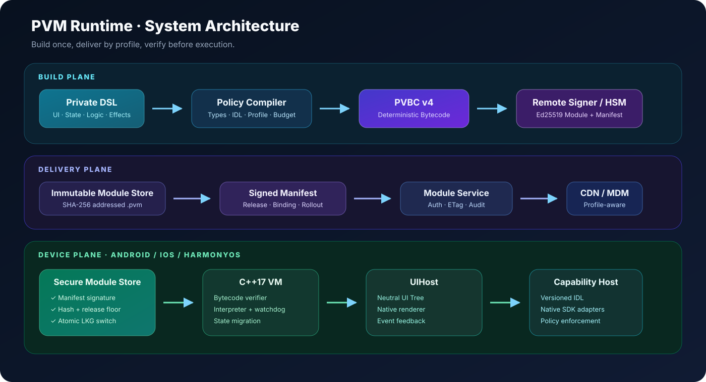
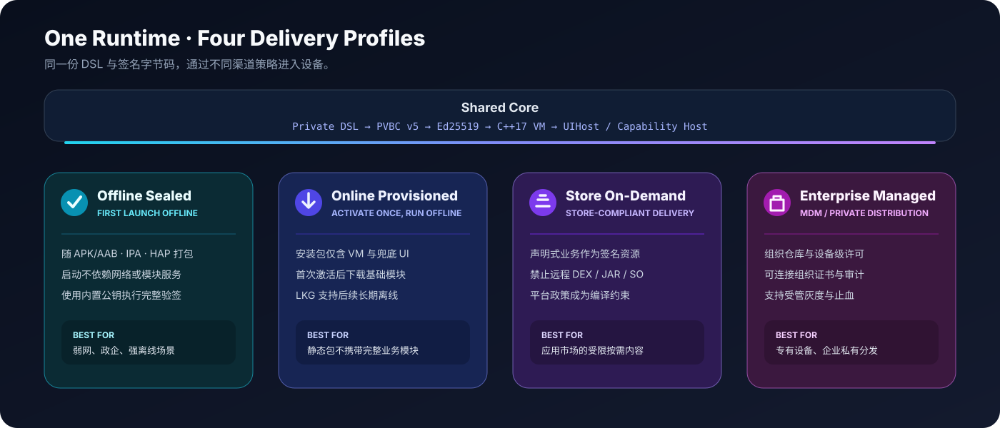
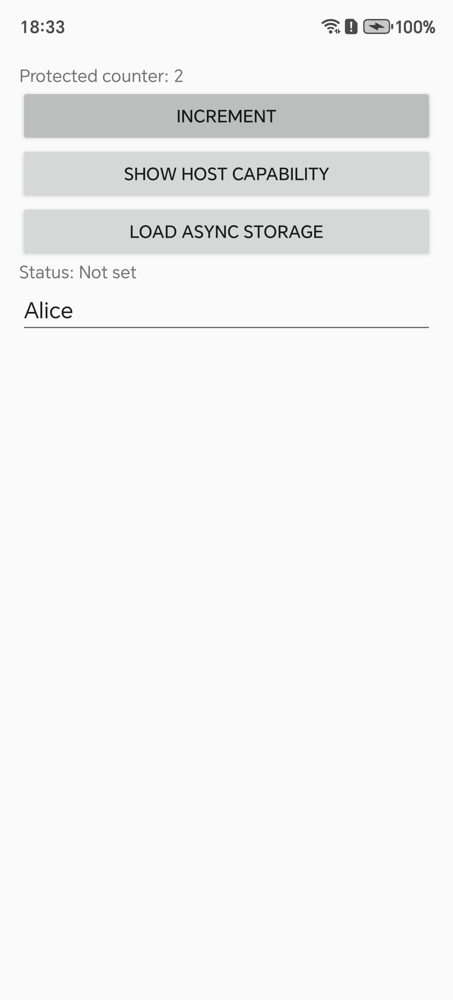
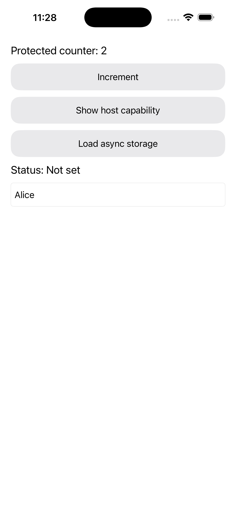

# PVM Runtime

> 通用受保护 App Runtime：用私有 DSL 描述业务页面、状态和流程，编译成签名字节码，再由同一套 C++17 VM 在 Android、iOS 与 HarmonyOS 上验证和执行。

`PVM Runtime` 面向需要跨端交付、原生体验和业务逻辑保护的应用。业务不会以 Kotlin、Swift、ArkTS 或 JavaScript 源码进入生产包；VM 只通过受限的 `UIHost` 和版本化 `Capability Host` 使用原生 UI 与系统能力。

当前仓库是一套可运行、可测试、可继续产品化的工程基线，不把应用商店审核、正式 HSM、商业 SDK、三端真机或红队结果冒充为已经完成。

`Runtime 5` · `PVBC v5` · `C++17` · `Ed25519` · `Android / iOS / HarmonyOS`

## 它解决什么

传统跨端方案通常需要在“原生能力”“动态业务交付”“离线可用”和“源码保护”之间取舍。PVM Runtime 把这些约束拆成稳定核心与四种交付 Profile：

- 一份 DSL 源码按目标平台和交付 Profile 生成独立签名模块，共用同一种 PVBC
  格式与业务语义，不复制多套业务源码；单个 `.pvm` 不会跨平台混用。
- 一个 C++17 Runtime 负责签名、绑定、防回滚、字节码和资源预算验证。
- UI 仍由宿主原生后端渲染；当前构建覆盖 Android View、UIKit/SwiftUI 和 ArkUI
  合同，Compose/CMP 与 Kuikly 仅是尚未接入产品构建的原型。
- 支付、地图、相机、音视频、推送等重能力留在宿主，通过版本化 Capability IDL 调用。
- `Offline Sealed` 与联网交付不是互相冒充的模式，而是明确分离的构建产物。

## 系统架构



系统分为三个信任平面：

| 平面 | 主要职责 | 关键产物 |
|---|---|---|
| Build Plane | DSL 静态检查、Profile/IDL 约束、确定性编译、远程签名 | `PVBC` payload、签名 `.pvm` |
| Delivery Plane | 内容寻址仓库、签名 Manifest、激活鉴权、灰度、审计 | 不可变模块、Manifest 信封 |
| Device Plane | Manifest/模块验签、防回滚、预加载、状态恢复、原生渲染 | LKG 缓存、UI Tree、Capability Effect |

完整设计见[架构与数据流](docs/ARCHITECTURE.md)和[安全模型](docs/SECURITY_MODEL.md)。

## 四种交付 Profile



| Profile | 模块如何进入设备 | 适合场景 |
|---|---|---|
| `Offline Sealed` | 由目标 App 工程把签名模块随 APK/AAB、IPA 或 HAP 打包 | 首次启动必须离线、弱网、政企 |
| `Online Provisioned` | 首次激活后下载，之后使用本地 LKG | 静态安装包不携带完整业务模块 |
| `Store On-Demand` | 应用市场允许范围内的签名资源交付 | 商店按需内容与合规更新 |
| `Enterprise Managed` | 私有仓库、MDM、组织许可与审计 | 企业私有分发和专有设备 |

编译器会把渠道政策变成构建约束，例如拒绝 Android Profile 外部下发 `.dex/.jar/.so`，以及拒绝 iOS Profile 声明 native 动态下载。

## 当前能力

### 编译与模块格式

- JSON 承载的私有 DSL，覆盖状态、页面树、事件、同步/异步 Effect 和资源预算。
- 确定性 PVBC v5 字节码；Runtime 5 兼容读取 v1–v5。
- Ed25519 模块签名、application/channel/platform/profile/release 绑定、SHA-256 内容寻址和签名 Manifest。
- v4 稳定 `persistence_id`，支持状态字段改名/新增迁移并拒绝类型冲突。
- v5 `event.value` 把 Input/Switch 的 change/submit 值安全送入处理器和状态。

### Runtime 与宿主

- C++17 加载器、字节码验证器、解释器、栈类型检查、控制流检查和指令 watchdog。
- C ABI v3 在创建时强制 application/channel/platform/profile/release floor 绑定，以及
  Android JNI、iOS Objective-C++、HarmonyOS Node-API 桥。
- Runtime 按“创建 → 可选恢复 → 单次启动 → 分发/完成 → 取消 → 销毁”的状态机执行；
  start 前拒绝事件和异步完成，start 后拒绝状态恢复和重复启动。
- 中立 UI Tree、事件回传、Native Surface、同步和异步 Capability。
- Android View、UIKit/SwiftUI 与 ArkUI 合同统一 `appear` absent→present 语义；三端
  Host 在 cancel/close 后丢弃迟到异步回调。
- Compose/CMP 与 Kuikly 目前只是未进入 Gradle/Swift 产品构建的 Port 原型。

### 安全交付

- Manifest 与模块双重验签、不可变模块 URL、同源限制和首次安装版本下限。
- 临时下载、大小/Hash 校验、VM 预加载、原子切换、双版本历史和 LKG 回退；三端
  LKG 状态严格绑定 application/channel/platform/profile/release 并校验当前 Hash 与历史。
- 稳定设备分桶、灰度止血、远程 signer 协议和 JSONL 审计。
- Linux ASan+UBSan、macOS UBSan、libFuzzer 包解析入口和恶意字节码测试。

## 快速开始

### 环境

- CMake 3.16+
- 支持 C++17 的 Clang 或 GCC
- Python 3.9+
- OpenSSL 3

macOS 会自动优先探测 Homebrew OpenSSL。其他环境可设置 `PVM_OPENSSL=/path/to/openssl`。

### 运行完整演示

```bash
make demo
```

该命令会：

1. 生成仅供本地开发使用的 Ed25519 密钥。
2. 编译 C++17 Runtime 与桌面 Host。
3. 编译并发布示例 DSL。
4. 启动临时模块服务并获取签名 Manifest。
5. 验证、缓存并执行模块。
6. 渲染计数器、处理点击并持久化状态。

再次运行会验证 release、恢复上一次状态并继续计数。

### 构建 Android APK、AAB 与 Runtime SDK

安装 JDK 17、Android SDK 36 和 NDK `28.0.13004108` 后执行：

```bash
make android-demo-check
```

该命令会运行 Android Lint，生成并检查：

| 产物 | 路径 | 用途 |
|---|---|---|
| Demo Debug APK | `dist/android/PVMRuntime-demo-debug.apk` | 直接安装和联调 |
| Demo Debug AAB | `dist/android/PVMRuntime-demo-debug.aab` | 验证 Bundle 打包 |
| R8 smoke APK | `dist/android/PVMRuntime-demo-minified-smoke.apk` | 非 debuggable、R8/JNI 真机回归 |
| Runtime AAR | `dist/android/pvm-runtime-0.5.0.aar` | Android Runtime Library |
| 本地 Maven | `dist/android/maven/` | `com.protectedvm:pvm-runtime:0.5.0`，自动传递依赖 |

门禁验证 APK/AAB 开发签名、API 36、双 ABI、模块/公钥/bootstrap 一致性、篡改拒绝、
Maven/独立 AAR 一致性、APK ZIP alignment，以及 AAR 内 ELF `PT_LOAD` 的 16 KiB 对齐。当前 R8 smoke APK
已在 HONOR BRP-AN00（API 35）完成启动、点击、异步 Capability、连续文本输入和状态
恢复验证。

<table>
  <tr>
    <th>Android · HONOR 真机</th>
    <th>iOS · iPhone 17 Pro Max Simulator</th>
  </tr>
  <tr>
    <td></td>
    <td></td>
  </tr>
</table>

两端运行的是同一份 Counter DSL 的平台绑定模块；图中的计数、异步存储状态与输入值都
经过原生控件事件 → Host → C++17 VM → 原生重绘链路，不是静态 Mock。Android 是一台
HONOR 物理设备的 smoke 证据，iOS 是 Simulator 证据，两者都不替代完整设备矩阵。

这些 APK/AAB 使用 Android Debug/测试签名，只是可安装的工程与 CI 证据，不是生产
商店包。正式业务 App 应依赖 Runtime Maven/AAR，嵌入自己平台/Profile 对应的模块，
并使用自己的 application ID、公钥、release floor 和正式签名。

### 构建 iOS Runtime SDK 与 Demo

在安装完整 Xcode 的 macOS 上执行：

```bash
make ios-sdk-check
```

该门禁通过 [`Package.swift`](Package.swift) 组织 C++17 Core、Objective-C++ Bridge 和
Swift Host，构建 `dist/ios/PVMBridge.xcframework`，并验证：

- arm64 iPhoneOS 与 arm64/x86_64 Simulator 静态 slice、iOS 15 deployment target。
- C ABI v3 和 Objective-C Bridge 符号、公开头文件、Swift 6 严格并发 typecheck。
- 一个实际链接 XCFramework 的 Swift consumer，以及产物不存在私钥或本机绝对路径泄漏。

Swift 层提供 `@MainActor PVMHost`、UIKit/SwiftUI Renderer、Module Store、Capability
Registry 与 `PrivacyInfo.xcprivacy`。

仓库也提供可直接在 Xcode 打开的
[`PVMRuntimeDemo.xcodeproj`](client/platform/ios/demo/PVMRuntimeDemo.xcodeproj)。
启动一个 iOS Simulator 后执行：

```bash
make ios-demo-check       # 构建并检查签名 Offline Sealed Demo
make ios-demo-run         # 安装并启动到唯一已 Boot 的 Simulator
make ios-demo-screenshot  # 重置 Demo 状态并复现 README 中的 iOS 截图
```

Demo 通过本地 Swift Package 接入完整 Runtime，构建阶段只嵌入 iOS
`offline_sealed` 的 `module.pvm`、公钥和 bootstrap。当前已在 iPhone 17 Pro Max
Simulator（iOS 26.2）完成启动、按钮、异步 Capability 和文本输入验证。它仍不是 IPA
或真机发布证据：目标 App 还需完成物理设备生命周期、archive/codesign、entitlement
和商店审核。

iOS 产品默认建议使用 `offline_sealed`，由目标 App 在审核包内携带签名业务模块。
如果产品选择在线字节码交付，必须针对实际功能和更新行为逐项评估
[Apple App Review Guidelines 2.5.2](https://developer.apple.com/app-store/review/guidelines/)；
签名、受限 VM 或 Profile 名称本身都不代表天然合规。

### 执行发布门禁

```bash
make release-check
```

完整门禁包括：

```text
test               端到端、安全、状态迁移与灰度测试
platform-check     Android/iOS/HarmonyOS Host 构建检查
verify-contracts   Host IDL 与 Renderer conformance
docs-check         README/docs 本地链接与 SVG 完整性
delivery-matrix    3 平台 × 4 Profile 交付产物
compatibility      5 业务域 × PVBC v1/v2/v3 历史兼容
sanitizer-check    Linux ASan+UBSan / macOS UBSan
fuzz-check         1000 次覆盖引导包解析模糊测试
```

需要 Android SDK 的 `make android-demo-check` 已登记为独立自动门禁，但不并入可在
无 Android SDK 环境运行的 `release-check` 聚合命令。需要 Xcode 的
`make ios-sdk-check` 同样登记为独立 iOS SDK 门禁，不并入该聚合命令。

`delivery-matrix` 生成供目标 App 工程嵌入的模块、公钥、Capability 和 bootstrap。
仓库内的 Android Demo 会把 Android Offline Sealed 输入封装成测试 APK/AAB；正式
APK/AAB 仍由接入方 Android 工程使用生产身份与签名生成。

### 单独运行模块服务

```bash
make bootstrap publish
PVM_ACTIVATION_TOKEN='replace-me' make serve
```

开发私钥位于被忽略的 `server/var/keys/`。正式环境必须改用隔离签名服务或 HSM，不能把演示私钥带入生产。

## 项目结构

```text
.
├── client/                  C++17 VM、C ABI、三端 Host 与模块仓库
│   ├── include/pvm/         公共 C/C++ 接口
│   ├── src/                 验证器、解释器、桌面 Host
│   ├── platform/            Android（Library/Demo）、iOS（SDK/Demo）、HarmonyOS、Kuikly
│   ├── tests/               C ABI 与 libFuzzer 入口
│   └── tools/               桌面 Provisioner
├── server/                  DSL 编译、签名、发布与模块服务
│   ├── sample/              可运行 DSL 与业务域矩阵
│   ├── src/pvm_server/      编译/交付实现
│   └── tools/               signer 等运维工具
├── spec/                    Host IDL、Renderer 与发布门禁合同
├── generated/               由 IDL 生成的四端接口
├── docs/                    架构、安全、平台、DSL 与运维文档
└── tests/                   端到端和安全回归测试
```

## 安全边界

PVM Runtime 提高静态分析、篡改和错误交付的成本，但不承诺“绝对不可逆向”：

- 设备完全失陷时，攻击者仍可能在解释执行期间观察字节码或状态。
- 完整源码、构建链和全部密钥同时泄露不在可防御范围内。
- 高价值授权、价格、权益和反欺诈规则仍应由可信服务端决定。
- 远程模块不能新增安装包未声明的权限，也不能下发原生可执行代码。

更完整的攻击者模型、密钥边界和失败策略见[安全模型](docs/SECURITY_MODEL.md)。

## 文档导航

| 文档 | 内容 |
|---|---|
| [文档中心](docs/README.md) | 阅读顺序、术语与文档地图 |
| [架构与数据流](docs/ARCHITECTURE.md) | 组件职责、信任平面、加载与更新流程 |
| [安全模型](docs/SECURITY_MODEL.md) | 威胁模型、密钥、控制项、非目标与响应 |
| [DSL 与字节码](docs/DSL_V1.md) | DSL 语义、PVBC v1–v5、输入事件与状态迁移 |
| [三端集成](docs/PLATFORM_INTEGRATION.md) | Android、iOS、HarmonyOS 与 C ABI 生命周期 |
| [发布与运维](docs/OPERATIONS.md) | 构建、发布、灰度、回滚、审计和故障处理 |
| [交付状态](docs/DELIVERY_STATUS.md) | 自动化证据、外部验收与剩余边界 |
| [功能完成度](docs/FUNCTIONAL_STATUS.md) | 各 Renderer/Capability 的真实实现与未完成项 |

## 项目成熟度

仓库内的编译、签名、发布、缓存、VM、三端桥接和自动化门禁已经形成闭环；Android
已经具备可分发 AAR/Maven、可安装 APK/AAB 和单台物理设备证据；iOS 已具备 Swift
Package、统一 Host、Privacy Manifest、可重复生成的静态 XCFramework，以及可运行
Simulator Demo。进入真实产品前仍需要使用目标 App、账号和 SDK 完成：

- 正式 KMS/HSM、密钥轮换和审计接入。
- iOS 真机、archive/Apple Distribution codesign 与审核证据；HarmonyOS DevEco
  HAR/HAP 和真机。
- KMP/CMP 的真实构建模块与发布产物；Kuikly 仅在产品确有需要时锁定版本并实现 Adapter。
- 支付、地图、相机、媒体、推送等实际 Capability Adapter。
- 应用商店审核、支付沙箱、持续长时 fuzz、红队和性能 SLO。

具体状态以[功能完成度](docs/FUNCTIONAL_STATUS.md)和[交付状态与外部验收](docs/DELIVERY_STATUS.md)为准。
