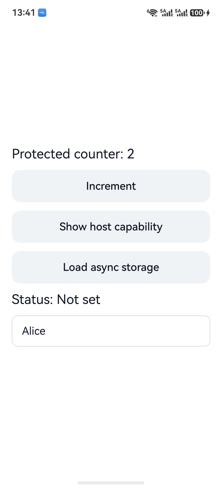

[简体中文](README.zh-CN.md)


# PVM Runtime

[](LICENSE)

> A protected, cross-platform application runtime: describe business screens,
> state, and flows in a private DSL; compile them into signed bytecode; then
> verify and execute them with one C++17 VM on Android, iOS, and HarmonyOS.

PVM Runtime targets applications that need cross-platform delivery, native user
experience, and stronger business-logic protection. Kotlin, Swift, ArkTS, and
JavaScript business source does not enter the production package. The VM can
reach native UI and system features only through a constrained `UIHost` and
versioned `Capability Host`.

`Runtime 5` · `PVBC v5` · `C++17` · `Ed25519` ·
`Android / iOS / HarmonyOS`

## What it solves

Cross-platform systems often trade native capability against dynamic delivery,
offline availability, or source protection. PVM separates those concerns into
a stable runtime and four explicit delivery profiles:

- One DSL source produces platform- and profile-bound signed modules with the
  same PVBC semantics. A single `.pvm` is never reused across platforms.
- One C++17 runtime validates signatures, bindings, rollback floors, bytecode,
  control flow, types, and resource budgets.
- Native hosts render the neutral UI tree. The current builds cover Android
  View, UIKit/SwiftUI, and ArkUI compiled with DevEco API 24.
- KMP publishes shared lifecycle and event APIs for JVM and Kotlin/Native.
  Compose/CMP and Kuikly renderers remain product-specific ports.
- The local migration scanner can select one class, multiple classes, or one
  or more existing modules and generate a reviewable DSL scaffold without
  modifying the legacy project. Strict verification blocks source drift,
  unresolved review items, unapproved capabilities, invalid DSL, and behavior
  mismatches before signing.
- Payments, maps, camera, media, push, and other privileged features remain in
  the host and are called through versioned capability IDs.
- Offline and network delivery are separate build outputs, not runtime flags
  that pretend to offer the same guarantees.

## Architecture


| Plane | Responsibility | Main outputs |
|---|---|---|
| Build Plane | DSL lint, profile/IDL constraints, deterministic compilation, remote signing | PVBC payload and signed `.pvm` |
| Delivery Plane | Content-addressed repository, signed manifests, activation, rollout, audit | Immutable modules and manifest envelopes |
| Device Plane | Signature verification, rollback prevention, preload, recovery, native rendering | LKG cache, UI tree, capability effects |

See [Architecture and data flow](docs/ARCHITECTURE.md) and
[Security model](docs/SECURITY_MODEL.md).

## Delivery profiles


| Profile | How the module reaches the device | Typical use |
|---|---|---|
| `Offline Sealed` | The target app embeds a signed module in an APK/AAB, IPA, or HAP | Offline first launch, weak networks, regulated enterprise |
| `Online Provisioned` | Download after activation, then use a local LKG | Keep the complete module out of the static package |
| `Store On-Demand` | Deliver signed resources through mechanisms allowed by the store | Store-managed on-demand content |
| `Enterprise Managed` | Private repository, MDM, organization license, and audit | Private distribution and managed devices |

The compiler turns channel policy into build constraints. For example, Android
profiles reject delivered `.dex`, `.jar`, and `.so`, while iOS profiles reject
native dynamic downloads.

## Precompiled SDK distribution

Consumer applications do not need to compile the PVM Runtime source. A versioned
SDK release contains:

| Platform | Precompiled dependency | Consumer entry |
|---|---|---|
| Android | `pvm-runtime-android-0.5.0.aar` or Maven | `com.protectedvm:pvm-runtime:0.5.0` |
| iOS | `PVMRuntimeBinaryPackage-0.5.0.zip` or `PVMRuntime-0.5.0.xcframework.zip` | `import PVMRuntime` |
| HarmonyOS | `pvm-runtime-harmony-0.5.0.har` | `import ... from '@pvm/runtime'` |

Maintainers with all three SDK toolchains run `make sdk-release-assets`; the
command builds, validates, and writes immutable upload inputs plus
`dist/release/SHA256SUMS`. Publishing a GitHub Release automatically publishes
the Android Maven coordinate to GitHub Packages. Target applications still own
their App ID, embedded business module, permissions, signing, and store package.

## Current capabilities

### Compiler and module format

- JSON-backed private DSL for state, UI trees, events, synchronous/asynchronous
  effects, and resource budgets.
- Deterministic PVBC v5 bytecode; Runtime 5 can read PVBC v1 through v5.
- Ed25519 module signatures, application/channel/platform/profile/release
  binding, SHA-256 content addressing, and signed manifests.
- Stable v4 `persistence_id` migration for renamed or added state fields, with
  type-conflict rejection.
- v5 `event.value` safely carries Input/Switch change and submit values into
  handlers and state.

### Runtime and hosts

- C++17 loader, bytecode verifier, interpreter, stack type checks, control-flow
  validation, and an instruction watchdog.
- C ABI v3 enforces application/channel/platform/profile/release-floor binding
  at creation and is bridged through Android JNI, iOS Objective-C++, and
  HarmonyOS Node-API.
- Lifecycle: create → optional restore → one start → dispatch/complete → cancel
  → destroy. Events and async completion are rejected before start; restore and
  repeated start are rejected after start.
- Neutral UI tree, event routing, native surfaces, and sync/async capabilities.
- Android View, UIKit/SwiftUI, and ArkUI share absent→present `appear`
  semantics and discard late callbacks after cancellation.
- KMP `commonMain` APIs compile for JVM and iOS, run lifecycle regression tests,
  and publish to Maven.

### Protected delivery

- Manifest and module verification, immutable module URLs, same-origin policy,
  and first-install release floors.
- Temporary downloads, size/hash checks, VM preload, atomic activation,
  two-version history, and LKG fallback.
- Stable rollout buckets, emergency rollout stop, remote signer protocol, and
  JSONL audit.
- Linux ASan+UBSan, macOS UBSan, a libFuzzer package-parser entry point, and
  malicious-bytecode regression tests.

## Quick start

### Requirements

- CMake 3.16+
- Clang or GCC with C++17
- Python 3.9+
- OpenSSL 3

On macOS, the build probes Homebrew OpenSSL first. Elsewhere, set
`PVM_OPENSSL=/path/to/openssl` when needed.

### Run the complete desktop demo

```bash
make demo
```

The command creates development-only Ed25519 keys, builds the VM, compiles and
publishes the sample DSL, starts a temporary module service, verifies and
caches the signed module, renders the counter, processes an event, and persists
state. A second run verifies the release and restores the previous state.

### Build Android APK, AAB, and Runtime SDK

With JDK 17, Android SDK 36, and NDK `28.0.13004108` installed:

```bash
make android-demo-check
```

| Artifact | Path | Purpose |
|---|---|---|
| Debug APK | `dist/android/PVMRuntime-demo-debug.apk` | Direct installation and integration |
| Debug AAB | `dist/android/PVMRuntime-demo-debug.aab` | Bundle packaging validation |
| R8 smoke APK | `dist/android/PVMRuntime-demo-minified-smoke.apk` | Non-debuggable R8/JNI device regression |
| Runtime AAR | `dist/android/pvm-runtime-0.5.0.aar` | Android runtime library |
| Maven repository | `dist/android/maven/` | `com.protectedvm:pvm-runtime:0.5.0` |

The gate checks development signatures, API 36, both ABIs, embedded
module/key/bootstrap consistency, tamper rejection, Maven/AAR consistency, APK
ZIP alignment, and 16 KiB ELF `PT_LOAD` alignment.

<table>
  <tr>
    <th>Android · HONOR physical device</th>
    <th>iOS · iPhone 17 Pro Max Simulator</th>
    <th>HarmonyOS · HUAWEI Pura 70 physical device</th>
  </tr>
  <tr>
    <td></td>
    <td></td>
    <td></td>
  </tr>
</table>

All three run platform-bound builds of the same Counter DSL. Counter changes,
asynchronous storage, and input values travel through native control → host →
C++17 VM → native redraw; they are not static mocks. Android and HarmonyOS
images are physical-device smoke evidence. The iOS image is simulator evidence.
None replaces a complete production device matrix.

The development APK/AAB uses debug/test signing. A production app should consume
the Maven/AAR, embed the module for its own platform/profile, and use its own
application ID, public key, release floor, and production signing identity.

### Build the iOS Runtime SDK and demo

On macOS with full Xcode:

```bash
make ios-sdk-check
make ios-demo-check
make ios-demo-run
make ios-demo-screenshot
```

`Package.swift` remains available for source development. The release gate builds
`dist/ios/PVMRuntime.xcframework`, which contains the Swift Host, UIKit/SwiftUI
renderers, CryptoKit verifier, Objective-C++ bridge, and C++17 VM. It validates
device and simulator slices, stable Swift interfaces, iOS 15 deployment targets,
a real binary Swift consumer, and the absence of private keys or local paths.

The repository includes
[`PVMRuntimeDemo.xcodeproj`](client/platform/ios/demo/PVMRuntimeDemo.xcodeproj).
Current evidence covers an iPhone 17 Pro Max Simulator on iOS 26.2. A target app
still needs physical-device lifecycle, archive/codesign, entitlements, and App
Store review evidence.

`offline_sealed` is the default recommendation for iOS. Any online bytecode
delivery must be reviewed against the actual feature and
[Apple App Review Guideline 2.5.2](https://developer.apple.com/app-store/review/guidelines/).
A signature or constrained VM does not itself guarantee store compliance.

### Build HarmonyOS Runtime HAR and demo HAP

With DevEco Studio 6.1.1/API 24:

```bash
make harmony-sdk-check
make harmony-demo-run
make harmony-demo-screenshot
```

The gate builds an API 23-compatible Runtime HAR and unsigned Offline Sealed
demo HAP with arm64-v8a/x86_64 C++17 Node-API, ArkTS host, ArkUI renderer, and
module/key/bootstrap binding. Outputs are written to `dist/harmony/`.

For a physical device, use a Huawei-signed HAP and explicit target:

```bash
HARMONY_DEVICE_TARGET=your-device-id \
HARMONY_SIGNED_HAP=/path/to/huawei-debug-signed.hap \
make harmony-device-screenshot
```

Current physical evidence covers one HUAWEI Pura 70 on HarmonyOS 6.1 with API
23 compatibility. It is not commercial/AppGallery signing evidence.

### Run release gates

```bash
make release-check
```

The aggregate includes end-to-end and security tests, host build checks, IDL and
renderer conformance, bilingual documentation checks, the 3-platform ×
4-profile delivery matrix, historical bytecode compatibility, sanitizers,
fuzzing, and KMP compilation. Android, Xcode, and DevEco artifact gates remain
separate because they require their respective SDKs.

KMP uses a project-local Gradle cache and does not clean caches belonging to
other desktop projects:

```bash
make kmp-check
make kmp-packages
```

### Run the module service

```bash
make bootstrap publish
PVM_ACTIVATION_TOKEN='replace-me' make serve
```

The service supports TLS 1.2+, token files, liveness/readiness, request IDs,
security headers, timeouts, and container health checks. Development keys live
under ignored `server/var/keys/`; production must use an isolated signer or HSM.

## Repository layout

```text
.
├── client/                  C++17 VM, C ABI, platform hosts, module stores
├── server/                  DSL compiler, signing, publication, module service
├── spec/                    Host IDL, renderer, and release-gate contracts
├── generated/               Generated C++/Kotlin/Swift/ArkTS host interfaces
├── docs/                    Architecture, security, platform, DSL, operations
└── tests/                   End-to-end and security regression tests
```

## Security boundary

PVM raises the cost of static analysis, tampering, and incorrect delivery. It
does not claim absolute resistance to reverse engineering:

- A fully compromised device may observe bytecode or state during execution.
- Simultaneous loss of source, build chain, and all signing keys is out of scope.
- Authorization, pricing, entitlement, and anti-fraud decisions remain on a
  trusted server.
- A remote module cannot add undeclared permissions or deliver native code.

See [Security model](docs/SECURITY_MODEL.md) and [Security policy](SECURITY.md).

## Documentation

| Document | Purpose |
|---|---|
| [Documentation hub](docs/README.md) | Reading order, terminology, document map |
| [Architecture](docs/ARCHITECTURE.md) | Trust planes, loading, state, updates |
| [Security model](docs/SECURITY_MODEL.md) | Threats, keys, controls, non-goals |
| [DSL and bytecode](docs/DSL_V1.md) | DSL semantics and PVBC v1–v5 |
| [Selective migration](docs/MIGRATION.md) | Migrate selected classes or modules from an existing app |
| [Platform integration](docs/PLATFORM_INTEGRATION.md) | Android, iOS, HarmonyOS, KMP |
| [Operations](docs/OPERATIONS.md) | Build, publish, rollout, rollback, audit |
| [Delivery status](docs/DELIVERY_STATUS.md) | Automated and external evidence |
| [Functional status](docs/FUNCTIONAL_STATUS.md) | Implemented and remaining work |
| [Contributing](CONTRIBUTING.md) | Issue-to-PR and review workflow |

Every English Markdown document has a Simplified Chinese `.zh-CN.md` peer.

## Maturity

The repository closes the compiler→signature→delivery→cache→VM→platform-host
loop and has repeatable CI evidence. Production adoption still requires the
target organization's KMS/HSM, account identities, commercial capability
adapters, broader device labs, store review, payment sandbox, sustained fuzzing,
red-team work, and performance SLOs. Treat
[Functional status](docs/FUNCTIONAL_STATUS.md) and
[Delivery status](docs/DELIVERY_STATUS.md) as the source of truth.

## License

PVM Runtime is licensed under the [Apache License 2.0](LICENSE). Commercial
use, modification, redistribution, and private use are permitted under its
terms. Redistributions must preserve the required copyright and license
notices, identify modified files, and retain any applicable `NOTICE`
attributions.
