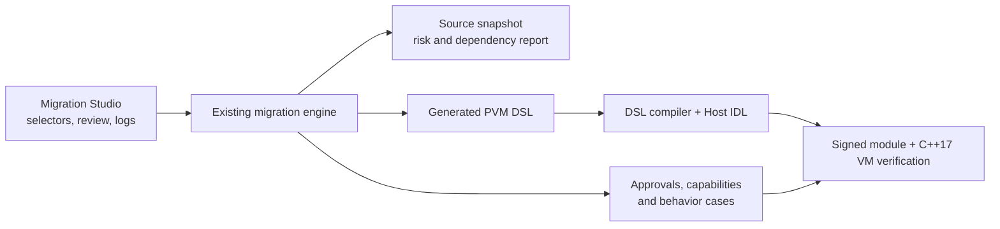

[简体中文](MIGRATION_STUDIO.zh-CN.md)

# PVM Migration Studio

PVM Migration Studio is a C++17/Qt desktop frontend for selective migration.
It does not contain a second migration engine: Scan, Convert, and Verify invoke
the same scanner, converter, DSL compiler, Host IDL checks, signer, and C++17 VM
used by the command line and CI.


## Workflow

1. Choose the legacy source directory and a repository-local output directory.
2. Add one or more class or module selectors. The application never performs an
   implicit whole-project conversion.
3. Run **Scan** and inspect the selected declarations, dependencies, risk hints,
   and suggested capabilities.
4. Run **Convert** to generate the DSL scaffold and review files.
5. Use the **Review** tab to edit approvals, capabilities, behavior cases, and
   the generated DSL. JSON files are validated and saved atomically.
6. Run **Structural Verify** while filling review decisions.
7. Run **Strict Verify** with the target binding, runtime, and signing keys
   before accepting the migration.

The progress bar consumes JSON Lines events emitted by the migration backend,
so it represents real stages rather than a timer. The current operation can be
cancelled, and the bounded, color-coded log can be copied or exported.



## Build and run

From the repository root:

```bash
make migration-studio-package
make migration-studio-run
```

All downloads, source, build caches, and outputs remain under this repository:

| Path | Purpose |
|---|---|
| `tools/migration-studio/` | C++17/Qt application source |
| `third_party/qt/6.12.0/` | Repository-local pinned Qt SDK |
| `build/migration-studio-tools/` | Repository-local `aqtinstall` and archives |
| `build/migration-studio/` | CMake build tree |
| `dist/desktop/PVMMigrationStudio.app` | Relocatable macOS development package |
| `dist/release/PVM-Migration-Studio-*.zip` | Portable Release archives |
| `build/migration-studio-output/` | Default migration output |

Only the required Qt Base archive is installed. The macOS application is
dynamically linked to bundled Qt frameworks and includes the corresponding Qt
license and notice files.

## Downloadable packages

The `v0.5.0` GitHub Release provides separate archives for Windows x64, macOS
Apple Silicon, and macOS Intel:

- `PVM-Migration-Studio-0.5.0-Windows-x64.zip`
- `PVM-Migration-Studio-0.5.0-macOS-arm64.zip`
- `PVM-Migration-Studio-0.5.0-macOS-x64.zip`

Each archive contains the Qt application, a standalone migration backend,
the OpenSSL-enabled C++17 `pvm_cli`, JSON specifications, Qt runtime libraries,
and license notices. No system Python or OpenSSL installation is required.
Development or production private keys are never included; select the intended
keypair before strict verification.

Each archive has a neighboring `.sha256` file. The current public packages are
ad-hoc signed on macOS and unsigned on Windows. macOS may require **Open** from
the context menu on first launch, and Windows SmartScreen may show a warning
until organization code-signing certificates are configured.

Backend processes receive argument vectors through `QProcess`; no source path
is interpolated into a shell command. Displayed logs redact the selected source,
output, repository, and home-directory prefixes.

## Verification

```bash
make migration-check
make migration-studio-check
make migration-studio-package
```

`migration-studio-check` runs the UI-independent C++ self-check and a real child
process. The migration test runs the CLI with JSON Lines progress enabled.
Strict verification additionally checks source drift, unresolved reviews,
capability approvals, DSL validity, behavior cases, target binding, signing,
and C++17 VM execution.

The `Attach Desktop Packages` workflow builds packages on native Windows x64,
macOS ARM64, and macOS Intel runners, runs the frontend and embedded-backend
self-tests, verifies bundled resources, writes SHA-256 files, and attaches the
artifacts to an existing Release.
