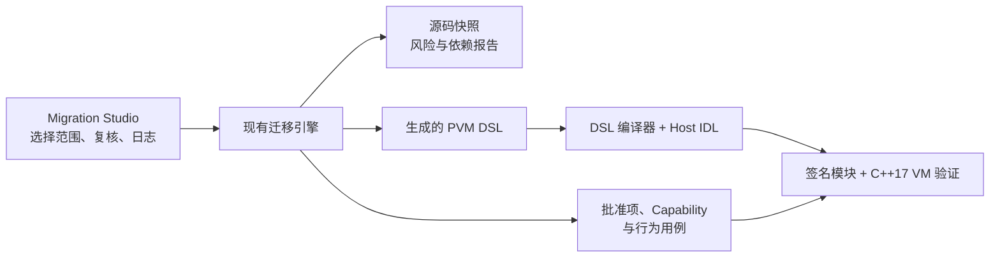

[English](MIGRATION_STUDIO.md)

# PVM Migration Studio

PVM Migration Studio 是用于选择性迁移的 C++17/Qt 桌面前端。它没有另写一套迁移
引擎：扫描、转换和验证调用的仍是命令行与 CI 共用的扫描器、转换器、DSL 编译器、
Host IDL 检查、签名器和 C++17 VM。


## 使用流程

1. 选择老项目源码目录和当前仓库内的输出目录。
2. 添加一个或多个类/模块选择器。程序不会隐式转换整个项目。
3. 执行**扫描**，检查选中声明、依赖、风险提示和建议 Capability。
4. 执行**转换**，生成 DSL 骨架和待复核文件。
5. 在**复核**页修改批准项、Capability、行为用例和 DSL。JSON 会先校验，再原子保存。
6. 补充复核结论期间执行**结构验证**。
7. 接受迁移前，使用目标绑定、Runtime 和签名密钥执行**严格验证**。

进度条消费迁移后端发出的 JSON Lines 事件，显示的是真实阶段，不是定时动画。当前
操作可以取消；带颜色且有容量上限的日志可以复制或导出。



## 构建与运行

从仓库根目录执行：

```bash
make migration-studio-package
make migration-studio-run
```

下载内容、源码、构建缓存和产物都留在当前仓库：

| 路径 | 用途 |
|---|---|
| `tools/migration-studio/` | C++17/Qt 应用源码 |
| `third_party/qt/6.10.3/` | 仓库内固定版本的 Qt SDK |
| `build/migration-studio-tools/` | 仓库内的 `aqtinstall` 与下载归档 |
| `build/migration-studio/` | CMake 构建目录 |
| `dist/desktop/PVMMigrationStudio.app` | 可移动的 macOS 开发包 |
| `dist/release/PVM-Migration-Studio-*.zip` | 可直接分发的 Release 压缩包 |
| `build/migration-studio-output/` | 默认迁移输出 |

安装脚本只下载需要的 Qt Base 归档。macOS 应用动态链接随包携带的 Qt Framework，
并包含对应的 Qt 许可和 NOTICE 文件。

## 可下载软件包

`v0.6.0` GitHub Release 分别提供 Windows x64、macOS Apple Silicon 和 macOS Intel
压缩包：

- `PVM-Migration-Studio-0.6.0-Windows-x64.zip`
- `PVM-Migration-Studio-0.6.0-macOS-arm64.zip`
- `PVM-Migration-Studio-0.6.0-macOS-x64.zip`

每个压缩包都包含 Qt 主程序、独立迁移后端、启用 OpenSSL 的 C++17 `pvm_cli`、JSON
规范、Qt 运行库和许可说明，不要求电脑另装 Python 或 OpenSSL。软件包不会携带开发
或生产私钥；严格验证前需要选择实际使用的密钥对。

每个 ZIP 旁边都有 `.sha256` 校验文件。当前公开的 macOS 包使用 ad-hoc 签名，
Windows 包尚未做 Authenticode 签名。macOS 首次运行时可能需要从右键菜单选择
**打开**，Windows 在配置组织代码签名证书前可能显示 SmartScreen 提示。

后端进程通过 `QProcess` 接收参数数组，不会把源码路径拼接成 Shell 命令。界面日志
会隐藏所选源码、输出、仓库和用户主目录的路径前缀。

## 验证

```bash
make migration-check
make migration-studio-check
make migration-studio-package
```

`migration-studio-check` 会运行与界面无关的 C++ 自检和真实子进程；迁移测试会启用
JSON Lines 进度并调用真实 CLI。严格验证还会检查源码漂移、未完成复核、Capability
批准、DSL 合法性、行为用例、目标绑定、签名和 C++17 VM 执行。

`Attach Desktop Packages` 工作流会在原生 Windows x64、macOS ARM64 和 macOS
Intel Runner 上构建软件包，执行主程序与内置后端自检、检查随包资源、生成 SHA-256，
然后把产物追加到已有 Release。
