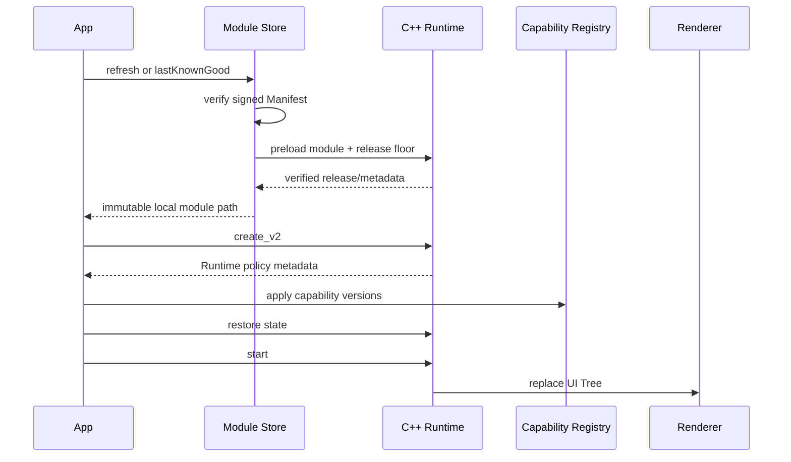

# Android、iOS 与 HarmonyOS 集成

三端共用 [`client/include/pvm/runtime_c.h`](../client/include/pvm/runtime_c.h) 和同一套 C++17 VM。平台层只负责：

1. 提供 Ed25519 验签实现。
2. 管理模块下载、文件保护、LKG 和 release floor。
3. 把中立 UI Tree 映射到目标 UI 框架。
4. 注册并执行版本化 Capability。
5. 在正确线程转发事件、异步结果和生命周期。

不要在 JNI、Objective-C++ 或 Node-API 中复制字节码解释逻辑。

## 共享启动流程



宿主必须先安装验签器和 Capability，再启动 VM。

## Module Store 合同

所有平台实现必须满足：

- 生产模块服务只允许 HTTPS；明文 HTTP 仅限显式启用的 localhost 开发环境。
- Manifest 最大 64 KiB，必须验证 Ed25519 信封。
- 校验 `application/channel/platform/profile/release` 绑定。
- 最低序号为 `max(installed release, minimumRelease)`。
- `module_url` 必须与服务端同源，并严格等于 `/v1/modules/<sha256>.pvm`。
- 模块最大 16 MiB，先写临时文件，再校验大小、Hash、签名和字节码。
- VM 返回 release 必须与签名 Manifest 一致。
- 只有完整验证后才能原子切换。
- LKG 必须满足安装包 release floor。
- 缓存至少保留当前和上一已验证版本。

## Android

### 已提供

- `PvmRuntimeHost.kt`：Runtime 生命周期、UI 批次与 Effect。
- `PvmModuleStore.kt`：Manifest 验签、HTTPS 下载、原子 LKG。
- `PvmCrypto.kt`：Google Tink Ed25519 默认验签与可注入 verifier。
- `PvmModuleValidator.kt`：JNI 预加载验证。
- `AndroidViewRenderer.kt`：View Renderer。
- `compose/PvmComposeRenderer.kt`：Compose/CMP 适配接口。
- `CapabilityRegistry.kt` 与 `BasicAndroidCapabilities.kt`。
- `pvm_jni.cpp` 与 Android CMake。
- `runtime` Gradle Library：发布包含完整 C++ Runtime 的 AAR 和 Maven 元数据。
- `demo` Gradle Application：生成可安装的 Debug APK、Debug AAB 和 R8 smoke APK。

### Gradle 工程与版本

Android 工程位于 `client/platform/android`：

```text
client/platform/android/
├── runtime/     Android Library，复用现有 Kotlin/JNI/CMake 源码
├── demo/        Offline Sealed 演示 App
├── gradle/      校验过 SHA-256 的 Gradle Wrapper
└── gradlew
```

当前经过构建门禁的基线为：

| 项目 | 版本或范围 |
|---|---|
| Android Gradle Plugin | 8.11.1 |
| Gradle | 8.13 |
| Kotlin | 2.2.21 |
| JDK / Kotlin JVM target | 17 |
| compileSdk / Demo targetSdk | 36 |
| Runtime minSdk / Demo minSdk | 24 / 33 |
| NDK | 28.0.13004108 |
| CMake / C++ | 3.22.1 / C++17 |
| ABI | `arm64-v8a`、`x86_64` |

Runtime 的 Android Library 通过 `externalNativeBuild` 调用已有
`client/platform/android/CMakeLists.txt`。CMake 只把共享 C++ 核心编译一次，再链接为
`libpvm_android.so`；不要把解释器源码复制进 App 模块。

### 初始化 Module Store

```kotlin
val store =
    PvmModuleStore(
        root = File(context.noBackupFilesDir, "pvm"),
        publicKeyPath = publicKeyFile.absolutePath,
        applicationId = context.packageName,
        channel = "production",
        profile = "online_provisioned",
        serverBase = "https://modules.example.com",
        activationToken = activationToken,
        installationId = installationId,
        minimumRelease = BuildConfig.PVM_MINIMUM_RELEASE,
    )
```

`refresh()` 必须在工作线程调用。渲染批次应切回主线程；不要在 UI 线程执行网络或模块预加载。

### Ed25519

`runtime` 默认依赖 `com.google.crypto.tink:tink-android:1.23.0`。
`PvmCrypto` 从 X.509 SubjectPublicKeyInfo 公钥中提取 Ed25519 原始公钥，并使用 Tink
验证 Manifest 和 `.pvm` 签名，因此 API 24–32 不依赖平台 JCA 是否提供 Ed25519。

目标 App 如果已有经过审计的硬件、系统或厂商验签实现，可以在创建 Module Store 或
Runtime 前安装一次 verifier；安装后它会覆盖默认 Tink 路径：

```kotlin
PvmCrypto.installVerifier { keyPath, payload, signature ->
    auditedProvider.verify(keyPath, payload, signature)
}
```

不要根据 DSL 或远端配置动态选择 verifier。公钥、verifier 和 release floor 都属于宿主
信任根。

### 构建和验证 Android 产物

在仓库根目录执行：

```bash
make android-demo-check
```

该门禁会完成：

1. 构建桌面验证器。
2. 生成 Android Offline Sealed 模块、公钥和 bootstrap。
3. 运行 Runtime 与 Demo Android Lint。
4. 发布 Release AAR 和本地 Maven 仓库。
5. 构建 Debug APK、Debug AAB 和启用 R8 的非 debuggable smoke APK。
6. 检查 APK/AAB/AAR 的 ABI、签名、模块 Hash、篡改拒绝、Maven 依赖和 16 KiB
   对齐。

产物位于：

```text
dist/android/PVMRuntime-demo-debug.apk
dist/android/PVMRuntime-demo-debug.aab
dist/android/PVMRuntime-demo-minified-smoke.apk
dist/android/pvm-runtime-0.5.0.aar
dist/android/maven/com/protectedvm/pvm-runtime/0.5.0/
```

前两个 Demo 产物和 R8 smoke APK 使用 Android Debug keystore。smoke APK 虽然是
non-debuggable 且经过 R8，但仍然只用于验证 consumer rules、JNI 名称和裁剪后的启动
链路；这些产物都不是生产签名包，不能提交商店或交付客户。

需要在设备上复验 R8 产物时：

```bash
adb install -r dist/android/PVMRuntime-demo-minified-smoke.apk
```

### 在目标 App 中接入 Runtime

推荐使用生成的 Maven 仓库，因为 POM 会传递 Tink 等外部依赖：

```kotlin
// settings.gradle.kts
dependencyResolutionManagement {
    repositories {
        google()
        mavenCentral()
        maven {
            url = uri("/absolute/path/to/PVM-Runtime/dist/android/maven")
        }
    }
}
```

```kotlin
// app/build.gradle.kts
dependencies {
    implementation("com.protectedvm:pvm-runtime:0.5.0")
}
```

如果只能复制裸 AAR，AAR 不携带 Maven POM，目标 App 必须显式补上 Tink：

```kotlin
dependencies {
    implementation(files("libs/pvm-runtime-0.5.0.aar"))
    implementation("com.google.crypto.tink:tink-android:1.23.0")
}
```

AAR 已携带 JNI/R8 consumer rules。目标 App 仍需根据实际 Capability 合并
`INTERNET`、相机、定位等权限，并配置自身 application ID、正式公钥、
`minimumRelease`、签名证书和商店发布策略。

### 文件和打包

- Module Store 根目录使用内部 `noBackupFilesDir`，不要使用外部存储。
- 当前实现对模块和状态应用 `0600`。
- Offline Sealed 的 `module.pvm`、公钥和 bootstrap 可放入 APK 或 AAB 的受保护资源目录；APK 用于直接安装/测试/部分企业分发，AAB 用于 Google Play 生成设备 APK。
- 生产 Release 开启 R8 全量优化；AAR consumer rules 会保留 JNI native callback、
  `PvmModuleValidator` 和通过名称查找的 `PvmCrypto.verify`。
- NDK 产物是包含完整 Runtime 的 `libpvm_android.so`。
- NDK 28 产物的 ELF `PT_LOAD` 对齐为 16 KiB；门禁同时校验 ELF program header
  和 APK ZIP alignment，不能只依赖 `zipalign`。
- Capability manifest 生成的权限必须在打包时合并，远程模块不能新增权限。

`make delivery-matrix` 仍然只生成目标工程所需的嵌入输入，并在
`bootstrap.json.packageFormats` 中声明 `["apk", "aab"]`。仓库新增的 Demo Gradle
工程会把这些输入封装成可安装测试 APK/AAB；真正的业务生产包仍必须由目标 App 使用
正式 application ID、variant、keystore 和发布签名构建。

## iOS

### 已提供

- `PVMRuntimeBridge.mm/.h`：ARC Objective-C++ 桥和 C ABI。
- `PVMModuleStore.swift`：actor Module Store。
- `PVMPlatformCrypto.swift`：CryptoKit Ed25519。
- `PVMUIKitRenderer.swift` 与 `PVMSwiftUIRenderer.swift`。
- `PVMCapabilityRegistry.swift` 与基础 Capability。

### Module Store 配置

```swift
let configuration = PVMModuleStore.Configuration(
    root: appSupport.appendingPathComponent("pvm", isDirectory: true),
    publicKeyPath: publicKeyURL.path,
    applicationId: Bundle.main.bundleIdentifier!,
    channel: "production",
    profile: "online_provisioned",
    server: URL(string: "https://modules.example.com")!,
    activationToken: activationToken,
    installationId: installationId,
    minimumRelease: minimumRelease
)
```

创建 Store 时传入 validator closure，由 Objective-C++ Bridge/C ABI 预加载临时模块并返回模块 release。Store 会要求该值与 Manifest 一致。

### 线程和生命周期

- `PVMModuleStore` 是 actor，网络和缓存状态串行化。
- UI Renderer 必须在主线程应用 UI Tree。
- Objective-C++ Bridge 持有 `pvm_runtime*`，异步 completion 回到宿主串行上下文后再恢复 VM。
- 页面退出、场景关闭或模块替换前调用任务取消。

### 文件和打包

- 模块使用 `completeUntilFirstUserAuthentication`。
- 状态文件使用完整文件保护和原子写。
- 生产建议把 Runtime/Bridge 封装为静态 XCFramework；不从网络下载 Framework。
- CryptoKit 验证内置 X.509 SubjectPublicKeyInfo Ed25519 公钥。
- Capability 生成的 Usage Description/entitlement 必须进入 App 审核产物。

## HarmonyOS

### 已提供

- `pvm_napi.cpp`：标准 Node-API 桥。
- `PvmRuntimeHost.ets`：ArkTS Runtime/Capability Host。
- `PvmModuleStore.ets`：签名 Manifest、缓存与 LKG。
- `ArkUiRenderer.ets`：ArkUI 工厂接口。
- Kuikly Renderer 适配基线。

### App 必须注入

`PvmModuleStore` 构造时需要：

- `ModuleTransport`
- `ModuleFiles`
- `ModuleValidator`
- `publicKeyPath`
- `ModuleSignatureVerifier`
- `minimumRelease`

`ModuleFiles` 的这些方法不能为空操作：

```text
writeTextAtomic / writeBytesAtomic / moveAtomic
protectAtRest
sha256
decodeBase64
decodeUtf8
```

其中 Base64/UTF-8 解码必须保留原始 payload 字节，不能通过 JavaScript 字符串往返后再验签。

### 线程和平台边界

- ArkTS Host 把 UI 批次交给项目 ArkUI/Kuikly Renderer。
- Node-API 回调和 VM 生命周期必须在宿主选定的串行上下文中使用。
- `SignatureVerifier` 由目标 DevEco/Harmony Crypto 或 HUKS Adapter 实现。
- HUKS 可保护缓存密钥；HAP/HSP/远程资源策略仍由 Profile 与发布流水线约束。

当前机器没有 DevEco/HarmonyOS SDK，因此仓库门禁只编译可移植 Node-API C++ 并检查 ArkTS 合同，不能声称 HAP 或真机验证。

## C ABI 生命周期

推荐使用 v2 callbacks：

1. 安装 `pvm_host_callbacks_v2`，包括签名验证回调。
2. 调用 `pvm_runtime_create_v2`，完成模块签名、绑定、防回滚和字节码验证。
3. 读取 Runtime metadata，并让 Capability Registry 检查最低版本。
4. 可选调用 `pvm_runtime_restore_state`。
5. 调用 `pvm_runtime_start`。
6. tap/appear 等无值事件调用 `pvm_runtime_dispatch`；Input/Switch 的
   change/submit 调用 `pvm_runtime_dispatch_value`。
7. 异步结果调用 `pvm_runtime_complete_effect`。
8. 生命周期结束调用 `pvm_runtime_cancel_all_tasks`。
9. 两次调用 `pvm_runtime_snapshot_state` 获取长度和内容，并原子持久化。
10. 调用 `pvm_runtime_destroy`。

旧的 `pvm_runtime_create` 为 ABI 兼容保留；新移动端集成应使用带平台验签器的 v2。

`pvm_runtime_dispatch_value` 的值在调用期间被复制，并受模块
`max_state_bytes` 预算限制。DSL 处理器用 PVBC v5 `event.value` 读取它；对没有值的
事件执行该指令会明确失败。

## UI Renderer 合同

Renderer 接收的是结构树而不是平台对象：

```text
type
numeric node id
properties
registered events
children
```

要求：

- 属性批量应用，避免逐属性 JNI/Node-API 往返。
- 可访问性标签、动态字体和 RTL 由 Renderer 正确映射。
- `NativeSurface` 只承载宿主已注册类型。
- 地图手势、视频帧、相机预览等高频数据留在原生侧。
- Renderer conformance 检查结构语义，不要求跨平台像素完全一致。

## Capability 合同

Host IDL 生成 Kotlin、Swift、ArkTS 和 C++ 接口。Registry 必须：

- 注册 capability ID、版本、同步/异步类型。
- 在 Runtime 启动前应用模块 policy。
- 拒绝未声明、缺失或版本不足的能力。
- 对网络域名、存储 scope、系统权限和用户授权做宿主侧检查。
- 把平台错误转换为结构化结果，不向 DSL 暴露真实平台指针。

## 接入验收

- [ ] 生产公钥和 `minimumRelease` 固定进目标 App 配置。
- [ ] Module Store 使用内部受保护目录。
- [ ] Manifest/模块使用同一信任根或明确的轮换策略。
- [ ] UI、VM、网络和异步 completion 的线程规则明确。
- [ ] Capability 权限、隐私声明、版本和降级 UI 完成。
- [ ] App 冷启动优先加载 LKG，后台刷新不阻塞首屏。
- [ ] 损坏模块、错误签名、网络中断和 304 无缓存均有测试。
- [ ] Android/iOS/HarmonyOS 目标设备完成性能和生命周期验证。
