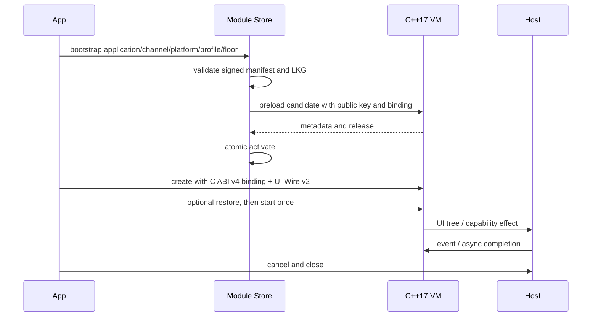

[简体中文](PLATFORM_INTEGRATION.zh-CN.md)

# Android, iOS, and HarmonyOS integration

All platform hosts use
[`client/include/pvm/runtime_c.h`](../client/include/pvm/runtime_c.h) and the
same C++17 VM. A platform layer only:

1. provides Ed25519 verification;
2. manages module delivery, protected files, LKG, and release floor;
3. maps the neutral UI tree to native UI;
4. registers and executes versioned capabilities;
5. serializes lifecycle and discards late callbacks after close.

## Shared startup flow



## Module Store contract

Every production store enforces:

- HTTPS or bundled source according to profile;
- signed manifest and module;
- application/channel/platform/profile equality;
- positive release, installation floor, and manifest/module release equality;
- same-origin immutable module URL;
- size and SHA-256 before preload;
- temporary file and atomic rename;
- at most two verified history entries;
- strict current-state binding and corruption rejection;
- fallback to a verified LKG without downgrade.

The platform may encrypt cache storage, but encryption does not replace
signature, hash, or release checks.

## Android

### Provided

- Kotlin runtime host and capability registry.
- JNI bridge, C ABI v4 runtime host, and v3 validation-only preload.
- Android View renderer and NativeSurface factory.
- Tink Ed25519 verification.
- HTTPS/bundled Module Store with atomic LKG.
- Gradle library, demo APK/AAB, R8 smoke, AAR, and Maven output.

### Gradle project and versions

```text
client/platform/android/
├── runtime/       Android Library
├── demo/          Offline Sealed application
├── gradle/        verified Gradle Wrapper
└── gradlew
```

The baseline uses JDK 17, Gradle 9.6.1, AGP 9.3.1 with built-in Kotlin 2.4.10,
compile/target SDK 36, NDK `28.0.13004108`, and arm64-v8a/x86_64.

### Initialize the Module Store

Construct `PvmModuleStore` with the application ID, channel, platform
`android`, selected profile, release floor, public key path, cache root, and
bootstrap/manifest source. Before activation, use `PvmModuleValidator` to
preload the candidate and require returned binding/release to match the signed
manifest.

`PvmCrypto` parses X.509 SubjectPublicKeyInfo Ed25519 keys and uses Tink by
default. Tests can inject a verifier, but production must not replace
verification with an always-true callback.

### Build and validate

```bash
make android-demo-check
```

Outputs:

```text
dist/android/PVMRuntime-demo-debug.apk
dist/android/PVMRuntime-demo-debug.aab
dist/android/PVMRuntime-demo-minified-smoke.apk
dist/android/pvm-runtime-0.5.0.aar
dist/android/maven/
```

Install the minified device smoke with:

```bash
adb install -r dist/android/PVMRuntime-demo-minified-smoke.apk
```

### Consume from a target app

For local development, use the generated Maven directory:

```kotlin
// settings.gradle.kts
dependencyResolutionManagement {
    repositories {
        google()
        mavenCentral()
        maven { url = uri("/absolute/path/to/PVM-Runtime/dist/android/maven") }
    }
}
```

After publishing `v0.5.0`, independent projects use the precompiled package:

```kotlin
maven {
    url = uri("https://maven.pkg.github.com/kairowan/PVM-Runtime")
    credentials {
        username = providers.gradleProperty("gpr.user").orNull
        password = providers.gradleProperty("gpr.key").orNull
    }
}
```

```kotlin
// app/build.gradle.kts
dependencies {
    implementation("com.protectedvm:pvm-runtime:0.5.0")
}
```

The target app supplies its own application ID, key, release floor, signing,
profile-specific module, capabilities, fallback UI, and production lifecycle.
Do not copy the demo's identity into production.

### Files and packaging

Offline Sealed inputs are generated by `make delivery-matrix` under
`build/delivery/client/android/<profile>/`. The target Android build packages
`module.pvm`, `module-public-key.pem`, and `bootstrap.json` as assets. Runtime
native libraries remain part of the AAR; remotely delivered native code is
forbidden.

## iOS

### Provided

- Objective-C++ C ABI bridge.
- `@MainActor PVMHost`.
- CryptoKit Ed25519 Module Store actor.
- UIKit and SwiftUI renderers.
- capability registry and basic adapters.
- Privacy Manifest, source Swift Package, complete binary XCFramework, and Xcode demo.

### Recommended profile

Use `offline_sealed` by default. Embed the iOS-bound signed module, public key,
and bootstrap in the reviewed app package. The precompiled framework is embedded
and signed with the target application; it is never downloaded at runtime.

Online delivery requires product-specific Apple 2.5.2 review, a built-in
fallback UI, and the same manifest/module/LKG controls.

### Online Module Store

`PVMModuleStore.Configuration` includes application, channel, profile, minimum
release, public key, cache location, bootstrap/manifest URL, activation token,
and limits. Candidate validation calls `PVMHost.validateModule`, which preloads
through the Objective-C++ bridge and returns binding metadata before activation.

### Threads and lifecycle

- `PVMModuleStore` is an actor and serializes network/cache state.
- `PVMHost` and renderers mutate UI on MainActor.
- Restore happens before one start.
- App/background shutdown cancels pending effects.
- Close is idempotent and prevents event, snapshot, and late completion entry.

### Build and run the demo

```bash
make ios-demo-check
make ios-demo-run
make ios-demo-screenshot
```

The demo uses the local Swift Package and embeds only the iOS
`offline_sealed` inputs. The screenshot command resets demo state before
deterministic interaction.

### Build and validate the SDK

```bash
make ios-sdk-check
```

Output:

```text
dist/ios/PVMRuntime.xcframework
```

The gate checks device/simulator slices, iOS 15, public symbols and headers,
stable Swift interfaces, Swift 6 strict concurrency, a real binary consumer,
and sensitive-path/key leaks. It is SDK evidence, not an IPA or App Store
decision.

### Consume the precompiled iOS SDK

Download and expand `PVMRuntimeBinaryPackage-0.5.0.zip`, then use
**File → Add Package Dependencies → Add Local** and select the extracted
`PVMRuntimeBinaryPackage` directory. The product is `PVMRuntime`:

```swift
import PVMRuntime
```

Alternatively, add `PVMRuntime.xcframework` directly to the target's
**Frameworks, Libraries, and Embedded Content** and select **Embed & Sign**.
Both paths link precompiled Swift/Objective-C++/C++ code; the consumer does not
compile PVM Runtime source.

## HarmonyOS

### Provided

- DevEco API 24 project compatible with API 23.
- Runtime HAR with C++17 Node-API, ArkTS host, ArkUI renderer, and verifier.
- Offline Sealed demo HAP with module/key/bootstrap.
- arm64-v8a and x86_64 native libraries.
- Module Store reference, session/state restoration, basic toast and KV
  capabilities.

Build:

```bash
make harmony-sdk-check
```

To consume the precompiled HAR, copy it to `entry/libs/` and declare:

```json5
{
  "dependencies": {
    "@pvm/runtime": "file:./libs/pvm-runtime-0.5.0.har"
  }
}
```

Run `ohpm install`, then import the package:

```typescript
import { PvmRuntimeSession, PvmRuntimeTree } from '@pvm/runtime'
```

The repository output `dist/harmony/PVMRuntime-demo-unsigned.hap` is for
emulator/development integration. A physical device requires an explicitly
selected Huawei-signed HAP:

```bash
HARMONY_DEVICE_TARGET=your-device-id \
HARMONY_SIGNED_HAP=/path/to/huawei-debug-signed.hap \
make harmony-device-run
```

### Target app responsibilities

The target app injects application/channel/profile/floor, public key, cache
root, bootstrap/manifest source, activation credentials, ArkUI NativeSurface
factories, capability adapters, HUKS policy, lifecycle hooks, and production
signing. It must validate HAP/HSP/resource policies for its selected profile.

### Threads and boundaries

Node-API calls enter the C++ VM; ArkTS session state and ArkUI rendering remain
on their platform execution context. Native effects capture a task generation
and discard completion after cancellation or close. Camera/media frame streams
stay in native components.

## KMP/CMP and Kuikly boundary

`client/platform/kmp` publishes `PvmRuntimePort`, `PvmRuntimeClient`, binding,
event, snapshot, and lifecycle models for commonMain/JVM/iOS. It does not create
a new `kmp` bytecode platform; Android/iOS/HarmonyOS modules remain bound to
their real platform.

Compose/CMP and Kuikly are renderer ports. The target product must select and
pin its UI framework version, connect the platform actual Runtime, provide
NativeSurface adapters, and validate UI on real devices. Kuikly should not be
added unless the product actually adopts it.

## C ABI lifecycle

```text
pvm_runtime_create_v4(callbacks.ui_wire_version = PVM_UI_WIRE_V2)
  → optional pvm_runtime_restore_state
  → pvm_runtime_start exactly once
  → pvm_runtime_dispatch / pvm_runtime_complete_effect / snapshot
  → pvm_runtime_cancel_all_tasks
  → pvm_runtime_destroy
```

The host owns serialized entry. C strings and UI batches are copied before the
next VM call. Effect task IDs are opaque 64-bit values. Wire v2 sends a complete
root for initial or structural commits and a patch containing root metadata,
changed-node subtrees, and ancestor revisions for stable structures. Existing
`create`, `create_v2`, and `create_v3` callers always receive complete-root Wire
v1.

### UI Wire v2

An initial or structural batch uses `operation: "replace"` and includes a
complete `root`. A stable-structure batch uses `operation: "patch"`:

```json
{
  "wireVersion": 2,
  "operation": "patch",
  "structureChanged": false,
  "rootId": 1,
  "rootType": "Column",
  "rootRevision": 42,
  "changed": [7],
  "nodes": [
    {
      "type": "Text",
      "id": 7,
      "revision": 42,
      "props": { "text": "Updated" },
      "events": [],
      "children": []
    }
  ],
  "revisions": [
    { "id": 1, "revision": 42 },
    { "id": 7, "revision": 42 }
  ]
}
```

`changed` order matches the top-level objects in `nodes`; a changed `List`
carries its current item subtree. `revisions` updates ancestor render gates
without resending their unchanged properties. Hosts reject missing or duplicate
IDs and require a complete root whenever identity, type, or structure changes.

## UI renderer contract

Renderers implement complete-tree structural replacement plus stable-structure
patches, stable numeric node identity, 11 node types, properties, accessibility,
tap/change/submit/appear, v5 event values, absent→present appear semantics,
native surfaces, and platform-thread confinement. Renderer conformance is
machine-readable in
[`spec/renderer_conformance.json`](../spec/renderer_conformance.json).

## Capability contract

Generated host IDs come from [`spec/host_idl.json`](../spec/host_idl.json).
Before a module starts, the host applies module capability versions and fails
if an adapter is missing or too old. Each adapter still validates permissions,
consent, arguments, thread, and vendor errors.

## Integration acceptance

- exact binding and release-floor mismatch tests;
- corrupt manifest/module/current-state rejection;
- offline first launch and online fallback;
- process death, restore, repeated start, cancel, and late callback;
- input/switch values and appear semantics;
- native capability permission denial and error mapping;
- release-signed artifact and physical-device lifecycle;
- performance, memory, accessibility, background, and store-policy evidence.
