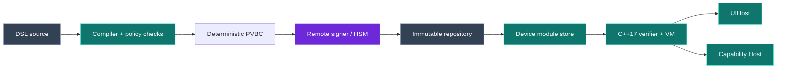

[English](SECURITY_MODEL.md)

# 安全模型

PVM Runtime 的目标是让业务模块在构建、交付、缓存和执行过程中保持可验证、受约束和可回退，并提高普通反编译、内容替换与错误发布的成本。它不是 DRM，也不承诺设备完全失陷后仍然保密。

## 保护目标

优先保护以下资产：

1. DSL 业务结构、状态与流程不以平台源码形式进入生产包。
2. 设备只执行由受信任发布密钥签名、且绑定当前
   application/channel/platform/profile/release 的模块。
3. 攻击者不能用旧的有效模块或 Manifest 绕过单调 release。
4. 损坏、超限或类型不安全的字节码不能进入解释执行。
5. 模块只能调用预先声明、宿主已安装且版本足够的 Capability。
6. 更新失败不能破坏已经验证的 LKG。

## 明确非目标

- 绝对不可逆向或防止拥有设备控制权的攻击者观察运行时明文。
- 在完整源码、完整构建链和全部签名密钥同时泄露后继续保证真实性。
- 让远程模块新增安装包没有声明的权限、entitlement 或原生代码。
- 替代服务端授权、计费、反欺诈、权益与高价值规则。
- 自动满足所有应用市场政策；Profile 约束只是发布合规的一部分。

## 攻击者模型

| 攻击者 | 典型能力 | 当前控制 |
|---|---|---|
| 普通静态分析者 | 解包 APK/IPA/HAP、搜索字符串、反编译平台代码 | 私有字节码、去源码标识、C++ VM、签名与符号隐藏 |
| 专业动态分析者 | Hook、调试、内存 Dump、篡改本地文件和网络响应 | 双重验签、Hash、防回滚、资源上限、LKG、平台风险信号预留 |
| 部分内部泄露者 | 获得部分业务源码、宿主代码或构建产物 | 构建/签名边界分离、远程 signer 协议、最小 Capability、审计 |

## 信任边界



- DSL 与仓库内容都按不可信输入处理；签名只证明发布授权，不替代格式验证。
- 私钥只存在于 signer/HSM 边界。编译器和模块服务不需要读取生产私钥。
- 客户端公钥属于安装包信任根；替换它等同替换 App 本身。
- Capability Host 是系统副作用边界，必须再次执行参数、权限、线程与用户授权检查。

## 签名对象

### 模块

`.pvm` 使用 `PVMP` 容器。Ed25519 签名覆盖完整 `PVBC` payload；客户端在解析任何业务表之前验证签名。

### Manifest

模块服务返回签名信封：

```json
{
  "envelope_format": 1,
  "payload": "<base64 canonical JSON>",
  "signature": "<base64 Ed25519 signature>",
  "signature_algorithm": "Ed25519"
}
```

签名 payload 绑定：

- `application_id`
- `channel`
- `platform`
- `profile`
- `release`
- `minimum_runtime`
- `bytecode_format`
- `capability_versions`
- `module_url`
- `sha256`
- `size`

灰度百分比和 `previous/current` 选择属于服务端控制层，不进入 release payload；无论选中哪一版，客户端拿到的都是独立签名信封。

## 防回滚

客户端接受的最低序号是：

```text
max(已安装 LKG release, 安装包 minimumRelease)
```

因此：

- 首次安装也能拒绝签名正确但过旧的模块。
- 网络失败时，低于 `minimumRelease` 的缓存不能成为 LKG。
- 灰度回滚只能阻止更多设备升级，不能让已升级设备接受较小 release。
- 若要把旧业务逻辑发给已升级设备，必须用更高 release 重新编译、签名和发布。

## 字节码安全边界

签名验证后仍执行以下检查：

- 包头、长度、格式和 Runtime 最低版本。
- application、channel、platform、profile 与单调 release 绑定；新移动端 Host 使用
  C ABI v3 传入四项预期值和 release floor，Store 再核对 VM release 与 Manifest。
- 表大小、索引、唯一性、状态类型和持久化 ID。
- 跳转目标、分支栈形状、指令操作数和 Capability 声明。
- UI 深度、节点唯一性、任务数、状态大小、栈和每事件指令预算。
- 运行时整数溢出、结果大小与 watchdog。

Runtime 对签名模块的预算也有硬上限，不能仅相信模块声明。包解析入口由 libFuzzer 持续覆盖。

## 更新与缓存安全

更新只有在以下步骤全部成功后才能切换：

1. 验证 Manifest 信封签名。
2. 验证 App/渠道/平台/Profile/release 绑定。
3. 验证同源、内容寻址 URL 和声明大小。
4. 下载到临时文件并同步落盘。
5. 验证 SHA-256。
6. 调用 C++ VM 验证模块签名、兼容性和字节码。
7. 原子移动为内容 Hash 文件并更新状态。
8. 保留最近两个已验证版本。

三端 `current` 状态自身也被当作不可信输入：只接受格式 v1、匹配当前
application/channel/platform/profile、正整数 release、合法当前 SHA-256，以及非空、
去重、最多两项且第一项等于当前 Hash 的历史。任何步骤或状态校验失败都不能覆盖或
冒充当前 LKG。

## 密钥管理要求

开发环境的 `server/var/keys/` 只用于演示。生产必须满足：

- 私钥由 KMS/HSM 或隔离 signer 持有，构建 Agent 只发送待签 payload。
- signer 对调用方、App、渠道、Profile、release 和 key version 做授权。
- 日志记录 key ID、请求身份、payload Hash、结果和时间，但不记录私钥或敏感明文。
- 轮换前先把新公钥信任根随 App 发布，再切换 signer；旧 key 的撤销策略必须与离线窗口一致。
- 构建产物、源码、signer 权限和发布权限由不同角色控制。

## 失败策略

| 故障 | 默认行为 |
|---|---|
| Manifest 网络或鉴权失败 | 使用满足 release floor 的 LKG |
| Manifest 签名/绑定失败 | 拒绝更新并记录安全事件 |
| 模块 Hash/签名/预加载失败 | 删除临时文件，保留 LKG |
| Capability 缺失或版本不足 | 启动前拒绝该模块或显示宿主降级 UI |
| 状态字段类型冲突 | 拒绝恢复，不把旧字节解释为新类型 |
| cancel/close 后异步结果迟到 | Host generation/closed guard 丢弃结果，不恢复 VM continuation |
| 仓库访问策略缺失 | 服务端默认要求激活，失败关闭 |

参考模块服务提供 TLS 1.2+、token 文件、请求超时、liveness/readiness、请求 ID、
安全响应头和非 root 容器。它仍必须置于生产 API Gateway/CDN、组织身份、集中审计和
多副本基础设施之后；这些外部控制不能由单进程参考服务替代。

## 生产验收清单

- [ ] 正式公钥随目标 App 构建并经过双人复核。
- [ ] signer/HSM 权限、轮换与恢复演练完成。
- [ ] Android KeyStore、iOS Keychain/File Protection、HarmonyOS HUKS 缓存策略完成。
- [ ] TLS、鉴权、CDN、审计与告警使用生产配置。
- [ ] 三端 Root/Jailbreak/Hook 信号进入风险评分，但不会误伤离线基础功能。
- [ ] `make release-check` 在受控 CI 中通过。
- [ ] Android 发布任务单独通过 `make android-demo-check`，iOS SDK 发布任务单独通过
      `make ios-sdk-check`。
- [ ] 持续 fuzz、依赖扫描、红队和真机性能报告归档。
- [ ] 支付、权益和高价值 API 在可信服务端再次授权。
